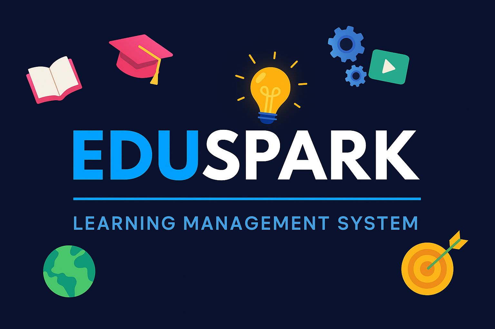

# 🚀 EduSpark - Learning Management System (LMS)

EduSpark is a **modern, responsive, and interactive Learning Management System website** created as part of a **Virtual Internship Project**.  
It provides a **beautiful UI**, **filterable courses**, **testimonials**, **blogs**, **FAQs**, and a **many more**.

🔗 **Live Demo:** [Click Here](http://learnwitheduspark.vercel.app)

---

## 📖 Table of Contents
1️⃣ [Hero Section](#-hero-section)  
2️⃣ [Trusted Companies / Partners](#-trusted-companies--partners)  
3️⃣ [Categories / Courses](#-categories--courses)  
4️⃣ [Why Choose Us (About)](#-why-choose-us-about)  
5️⃣ [Popular Courses](#-popular-courses)  
6️⃣ [Blog (Latest Articles)](#-blog-latest-articles)  
7️⃣ [Testimonials (Build Trust)](#-testimonials-build-trust)  
8️⃣ [FAQ Section](#-faq-section-answer-questions)  
9️⃣ [Call-to-Action (Join Now)](#-call-to-action-join-now--subscribe)  
🔟 [Footer](#-footer)  

---

## ✨ Features
✅ **Responsive Design** – Works on all devices  
✅ **Filterable Courses** – Sort courses by category  
✅ **Testimonials Carousel** – Auto-scroll with hover glow effect  
✅ **FAQ Accordion** – Expandable questions with smooth animation  
✅ **Notifications Dropdown** – Bell icon with badge count  
✅ **Contact Page with Map** – Google Maps integration  
✅ **Modern UI** – Beautiful fonts, colors, and layout  

---

## 🛠️ Tech Stack
- **HTML5**
- **CSS3**
- **JavaScript**

---

⭐ **If you like this project, don't forget to star the repo!**

---

